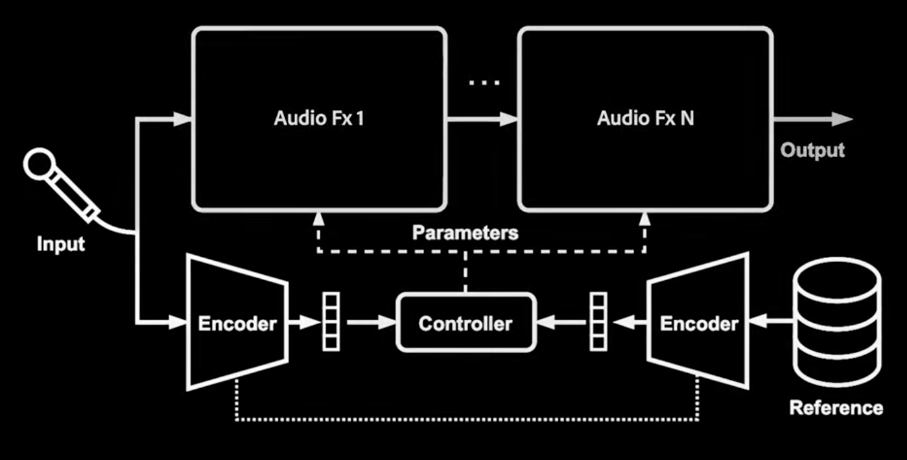
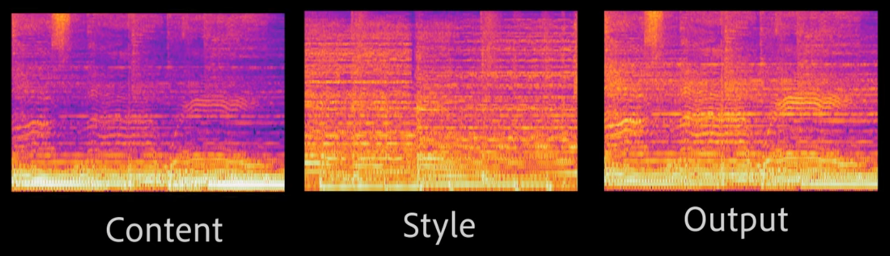
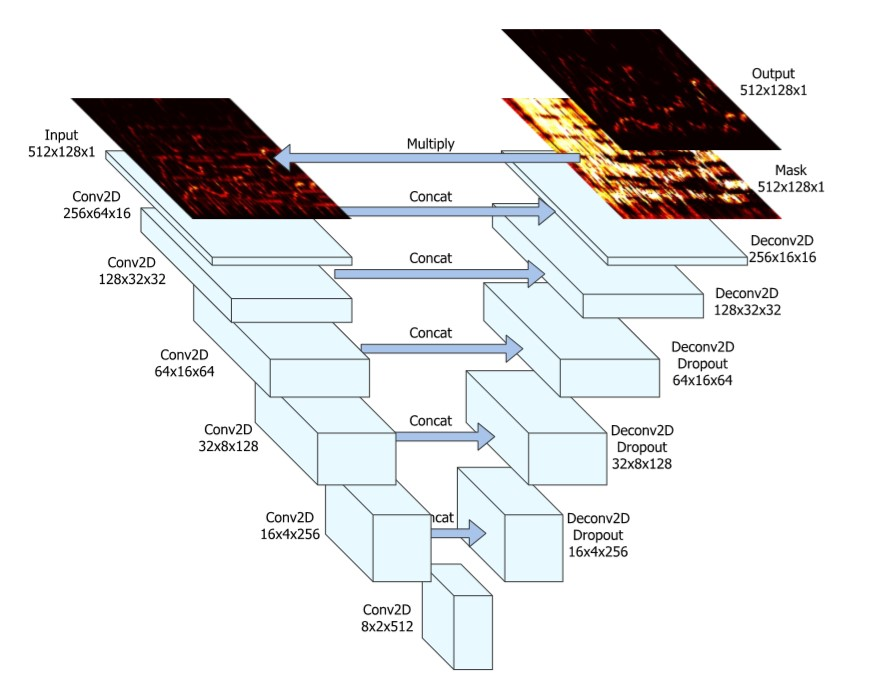
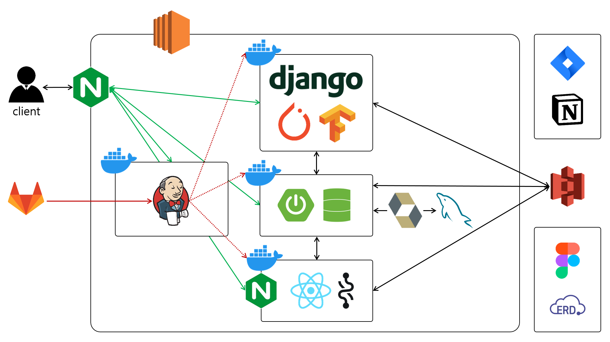
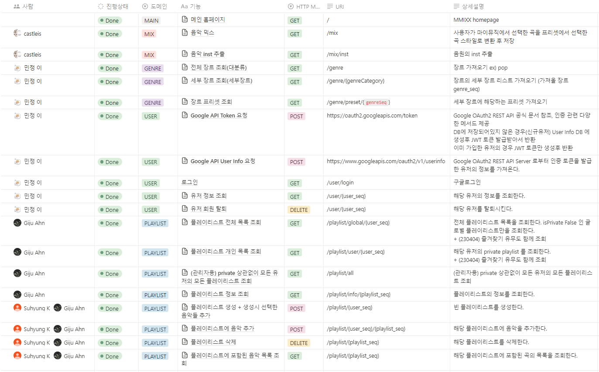
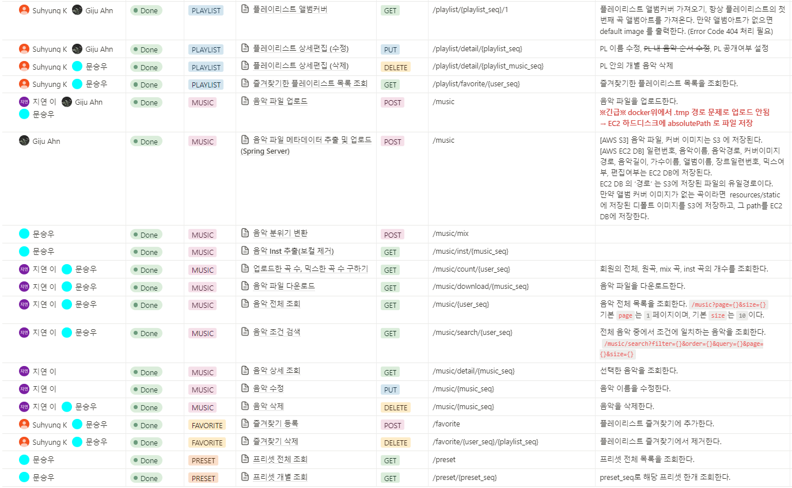
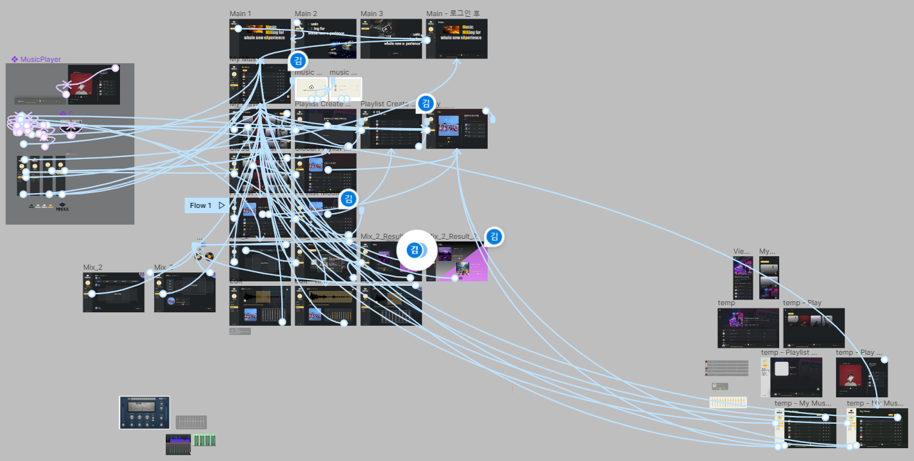
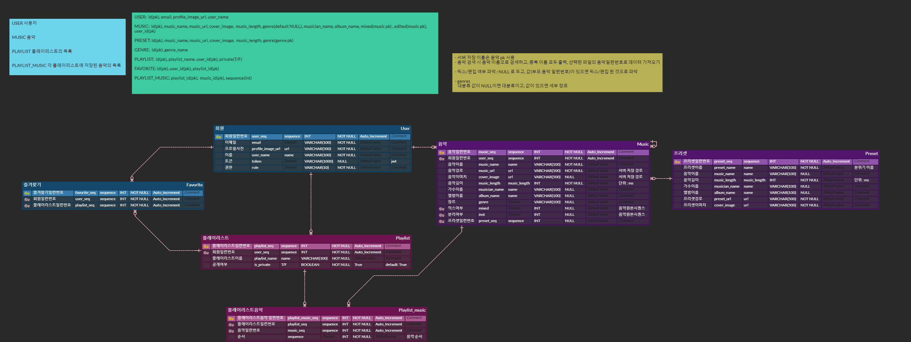

 
 
 
<a href="https://j8a403.p.ssafy.io/">

 

</a>

# **`MUSIC MIXING FOR WHOLE NEW EXPERIENCE`**

## **MMIXX 팀**

| 프로필                                                    | 이름 | 역할                                                                                                                                                                       | GitHub                                   |
|--------------------------------------------------------|----|--------------------------------------------------------------------------------------------------------------------------------------------------------------------------|------------------------------------------|
|  | 김수형 |                                                    | [@SuhyungK](https://github.com/SuhyungK) |
|  | 김성은 |    | [@castleis](https://github.com/castleis) |
|   | 이민정 |                                                       | [@ealswjd](https://github.com/ealswjd)   |
|    | 이지연 |                                                       | [@get783](https://github.com/get783)     |
|  | 문승우 |         | [@city1616](https://github.com/city1616) |
|   | 안기주 |         | [@GijuAhn](https://github.com/GijuAhn)   |

## **목차**
1. [서비스 소개](#서비스-소개)
2. [서비스 특징](#서비스-특징)
3. [딥러닝 아키텍처](#핵심-기능)
4. [서비스 아키텍처](#서비스-아키텍처)
5. [사용 기술](#사용-기술)
6. [API 명세](#API-명세)
7. [화면 설계](#화면-설계)
8. [데이터베이스 설계](#데이터베이스-설계)
9. [유저 가이드](#유저-가이드)

## **서비스 소개**

음악을 듣기만 하는 것이 지루해지셨나요?

***MMIXX*** 는 딥러닝 기반의 음악 믹싱 웹어플리케이션입니다.

곡의 분위기를 변화시킬 수 있는 **Music Style Transfer** 기능과,
연주음(MR) 과 보컬을 분리할 수 있는 **Sound Source Separation** 기능을 활용해 **자신만의 플레이리스트를 만들고 공유**해보세요!

## **서비스 특징**

* 음악 스타일 변환 
  * 웅장한, 신나는, 편안한, 강렬한, 밝은 등 다양한 분위기의 프리셋이 제공됩니다.
  * 원하는 스타일로 곡을 변환해보세요!
* 연주음/보컬 분리
  * 좋아하는 곡의 Inst. 버전을 찾기 어려우셨나요?
  * 연주음(MR)과 보컬을 깔끔하게 분리할 수 있습니다. 노래 연습, 녹음, 믹싱에 활용해보세요.
* 업로드 & 다운로드
  * 원하는 음악을 업로드해 믹싱에 활용해보세요!
  * 모든 파일은 개인 저장소에 저장되며, 다운로드도 가능합니다.
* 플레이리스트
  * 자신만의 플레이리스트를 만들고, 공유해보세요!
  * 다른 사람들이 만든 플레이리스트를 들어보고, 즐겨찾기로 추가할 수도 있습니다.
* 간편한 로그인
  * 구글 아이디로 간편하게 로그인해서 모든 서비스를 즐겨보세요.

## **딥러닝 아키텍처**
### Audio Style Transfer: DeepAFx-ST
 

### Sound Source Separation: Spleeter

## **서비스 아키텍처**

## **사용 기술**

| Category | Tech         | Version                 | Dockerization       |
| --- |--------------|-------------------------|---------------------|
| Version Control | GitLab       |                         |                     |
|  | JIRA         |                         |                     |
| Documentation | Notion       |                         |                     |
| Front-End | HTML5        |                         |                     |
|  | CSS3         |                         |                     |
|  | JavaScript   | ES6                     |                     |
|  | React        | 18.2.0                  |                     |
|  | Recoil       |                         |                     |
|  | Node.js      | 18.15.0                 |                     |
| Back-End | Java         | 11                      |                     |
|  | Gradle       | 7.6.1                   |                     |
|  | Spring Boot  | 2.7.10                  |                     |
|  | QueryDSL | 5.0.0                   |                     |
|  | JPA Hibernate |                         |                     |
|  | Python       | 3.8                     |                     |
|  | Django       | 3.2.13                  |                     |
| DataBase | MySQL        | 8.0.32                  |                     |
| Server | AWS EC2      |                         |                     |
|  | AWS S3       |                         |                     |
|  | NginX        | nginx/1.18.0 (Ubuntu)   | Latest Docker Image |
| CI/CD | Docker       | 23.0.1                  |                     |
|  | Jenkins      | 2.387.1                 | Latest Docker Image |

## **API 명세**

## **화면 설계**

## **데이터베이스 설계**

## **유저 가이드**
### 로그인

### 메인 페이지

### 파일 업로드

### 마이뮤직 기능

### 플레이리스트

### 믹스 (분위기 변환)

### 스플릿 (보컬 제거, MR 추출)

